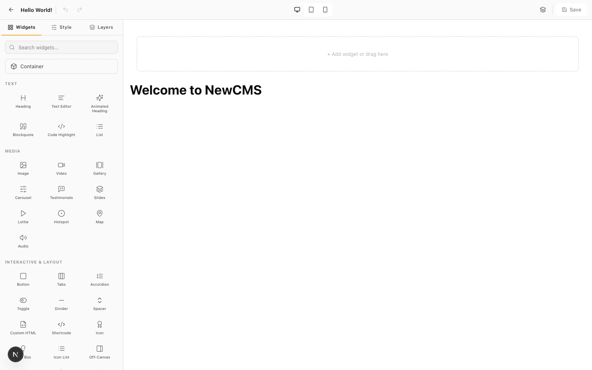
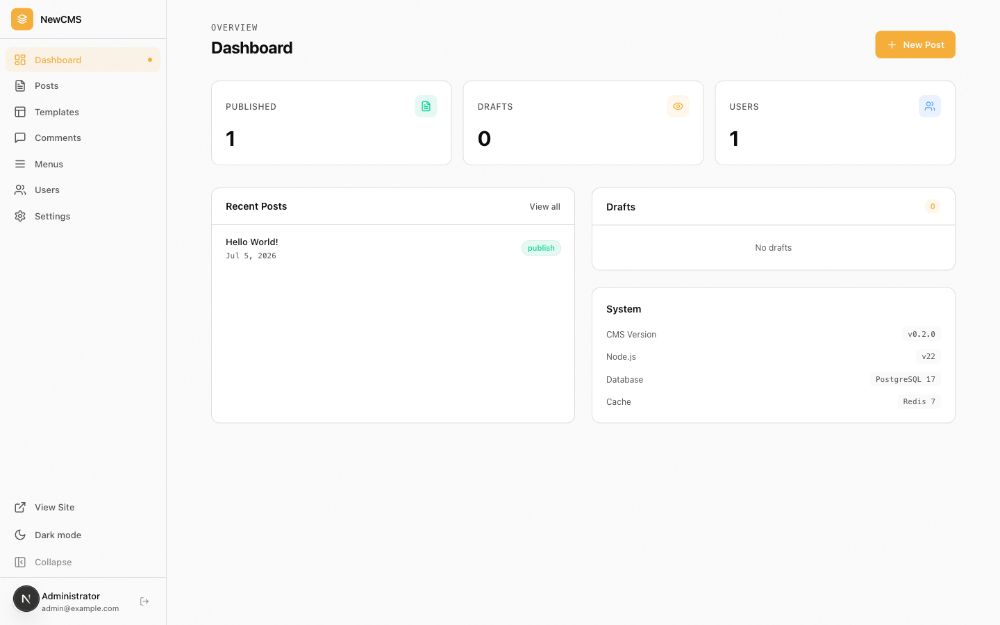
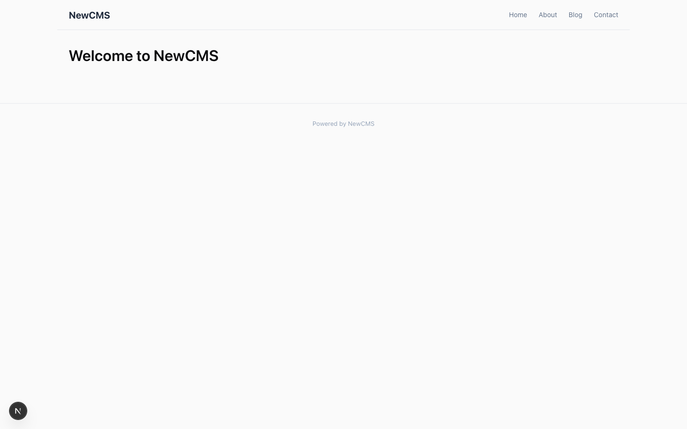

# NewCMS

A modern CMS built from scratch in TypeScript — a WordPress-inspired content model paired with an Elementor-inspired drag-and-drop visual builder. Monorepo powered by pnpm + Turborepo, with a NestJS REST API, a Next.js admin + public frontend, and nine standalone packages.

> **Project status:** demo / educational. This is a clean-room reimplementation exercise: the goal is to explore how a WordPress-class CMS and a visual page builder work under the hood, using a modern stack. It is not production software.



## What's inside

| App                    | Description                                                                                                                     |
| ---------------------- | ------------------------------------------------------------------------------------------------------------------------------- |
| [`apps/api`](apps/api) | REST API (NestJS 11) — posts, users, comments, taxonomy, media, settings, template kits, auth. Swagger at `/api/docs`.          |
| [`apps/web`](apps/web) | Next.js 15 App Router — admin dashboard, drag-and-drop visual editor, login, and the public-facing site with permalink routing. |

| Package                                             | Description                                                                                                      |
| --------------------------------------------------- | ---------------------------------------------------------------------------------------------------------------- |
| [`@newcms/core`](packages/core)                     | Hook engine (actions/filters), shortcodes, URL rewrite rules, theme & menu registries.                           |
| [`@newcms/database`](packages/database)             | Drizzle ORM schema (14 tables), repositories, Redis object cache, seed.                                          |
| [`@newcms/auth`](packages/auth)                     | Password hashing (bcrypt + HMAC pepper), sessions on Redis, nonces, roles & capabilities, application passwords. |
| [`@newcms/query-engine`](packages/query-engine)     | Declarative, type-safe post queries (tax/meta/date sub-queries) compiled to SQL.                                 |
| [`@newcms/editor`](packages/editor)                 | Block parser/serializer, element tree model, control system, CSS compiler, responsive breakpoints.               |
| [`@newcms/editor-ui`](packages/editor-ui)           | React UI for the visual builder — shell, control panel, preview canvas, 50+ widgets.                             |
| [`@newcms/html-processor`](packages/html-processor) | Zero-dependency HTML5 tag processor and tree parser.                                                             |
| [`@newcms/media`](packages/media)                   | Upload pipeline, image processing (sharp), storage adapters.                                                     |
| [`@newcms/config`](packages/config)                 | Shared tsconfig / vitest presets.                                                                                |

## Features

- **Admin dashboard** — posts, pages, comments moderation, users, media, settings, template kits.
- **Visual builder** — drag-and-drop editing with containers, 50+ widgets, responsive device preview, global design kit (colors & typography), dynamic tags.
- **Template kit import** — upload an Elementor-format template kit ZIP and get pages, templates and a design kit applied.
- **Public frontend** — permalink routing, sitemap generation, oEmbed providers.
- **WordPress-inspired core** — hooks (actions/filters), shortcodes, roles/capabilities, options with autoload, object cache.

## Stack

Node 22+ · TypeScript 5.9 (strict) · pnpm 10 + Turborepo · NestJS 11 · Next.js 15 / React 19 · Tailwind CSS 4 · Drizzle ORM · PostgreSQL 17 · Redis 7 · Vitest

## Create a new project

The fastest way to start your own site from this template:

```bash
pnpm create newcms my-site
# or: npm create newcms@latest my-site
```

This clones the template, generates a `.env` with a fresh `AUTH_SECRET`,
initializes git, and prints the next steps — including the agent instructions
(`AGENTS.md`) that ship with every new project.

## Quickstart

Requirements: Node.js 22+, pnpm 10+, Docker (or any container runtime with compose).

```bash
git clone https://github.com/durvs/newcms.git
cd newcms
pnpm install

cp .env.example .env      # defaults work out of the box for local dev
pnpm env:start            # postgres + redis via docker compose
pnpm db:migrate
pnpm db:seed
pnpm dev
```

Then open:

- **Admin:** http://localhost:3000/login — sign in with `admin` / `password`
- **Public site:** http://localhost:3000
- **API docs (Swagger):** http://localhost:3001/api/docs

The seed creates the admin user, default options and roles, a "Hello World!" post and a "Sample Page". Set `ADMIN_PASSWORD` before running `pnpm db:seed` to use a different password.

### Useful scripts

| Command                                     | What it does                                                   |
| ------------------------------------------- | -------------------------------------------------------------- |
| `pnpm dev`                                  | Run API + web + package watchers                               |
| `pnpm build`                                | Build everything                                               |
| `pnpm test` / `pnpm typecheck`              | Vitest suites / strict TS across the workspace                 |
| `pnpm db:migrate` / `pnpm db:seed`          | Apply Drizzle migrations / seed demo content                   |
| `pnpm env:start` / `env:stop` / `env:reset` | Manage the docker environment (`env:reset` wipes the database) |

## Screenshots

| Dashboard                                    | Visual editor                                        | Public site                                      |
| -------------------------------------------- | ---------------------------------------------------- | ------------------------------------------------ |
|  |  |  |

## For AI agents

Project-specific decisions are first-class here: [`AGENTS.md`](AGENTS.md) is
the entry point for AI coding agents (architecture map, commands, and the
rules that bite), and [`docs/decisions/`](docs/decisions) holds short ADRs
with the _why_ behind non-obvious choices. `CLAUDE.md` simply imports
`AGENTS.md`, so Claude Code and agents.md-compatible tools read the same
source of truth.

## Design documents

The original clean-room specifications that drove the implementation live in [`docs/specs/`](docs/specs) (written in Brazilian Portuguese):

- [`CLEAN-ROOM-SPEC.md`](docs/specs/CLEAN-ROOM-SPEC.md) — functional spec of the CMS core (35 subsystems).
- [`CLEAN-ROOM-SPEC-VISUAL-BUILDER.md`](docs/specs/CLEAN-ROOM-SPEC-VISUAL-BUILDER.md) — spec of the visual builder.
- [`REVERSE-ENGINEERING-PROMPT.md`](docs/specs/REVERSE-ENGINEERING-PROMPT.md) — the reimplementation brief that kicked off the project.

## Known limitations

- The **Menus** admin screen is a UI preview only — not wired to the API yet.
- Single-site only (no multisite), no plugin system yet.
- The demo targets local development; deploying elsewhere requires setting `API_URL` and the `siteurl`/`home` options.

## License

[GPL-2.0-or-later](LICENSE).
